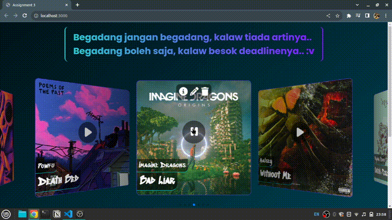
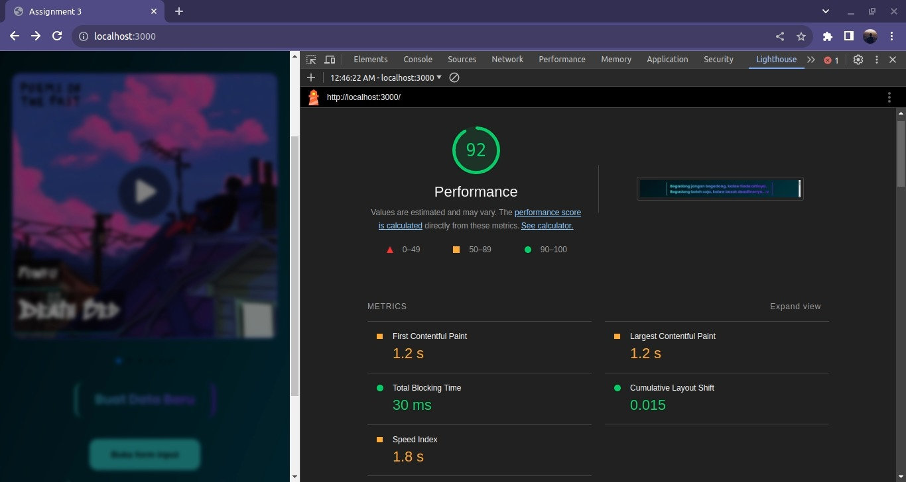

# Assignment 3 MSIB5 Hacktiv8
## JSON CRUD App

> [!IMPORTANT]
> * Tampilan tidak mobile friendly.
> * Banyak blink ketika menggunakan hot reload (contoh: Live Server).

## Overview
Ini adalah aplikasi CRUD ke data bertipe json dengan studi data musik. Aplikasi ini merupakan tugas assignment 3 dari materi AJAX dan fetch API pada javascript.
* Demo
* 
* Lighthouse perfomance report
* 

## Requirements
Dependency
* express: 4.18+
* multer: 1.4+

## Installation
### Using NPM
```sh
  npm install
```
### Using Yarn
```sh
  yarn install
```
### Run server
```sh
  node server
```
### Port quick access
[http://localhost:3000](http://localhost:3000)